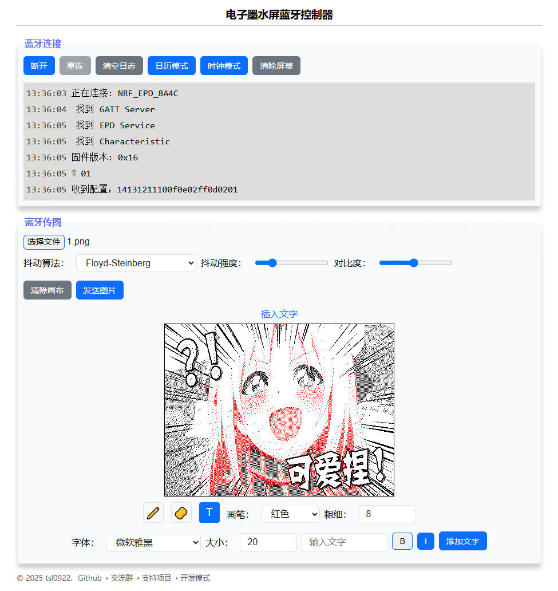

# EPD-nRF5

E-paper display calendar firmware with support for Chinese lunar calendar, solar terms, and holiday schedules. It can also transmit images via Bluetooth to the e-paper display for use as a digital photo frame. The calendar interface is adapted for common 4.2-inch and 7.5-inch e-paper resolutions, and the same firmware can drive different screen sizes (screen size and driver can be switched online through the web interface).

Supported MCUs: `nrf51822` / `nrf51802` / `nrf52811` / `nrf52810`. For e-paper displays, it supports common `UC81xx` / `SSD16xx` series drivers (black & white / 3-color / 4-color). It also supports custom pin mapping from the e-paper display to the MCU, sleep/wake functionality (NFC / wireless charger), and Bluetooth OTA firmware updates.

## Web Interface

This project includes a web-based interface implemented using Web Bluetooth API. You can use it on your phone or computer by visiting the URL below, or by directly double-clicking `html/index.html` locally.

- URL: https://tsl0922.github.io/EPD-nRF5
- Demo Video: https://www.bilibili.com/video/BV1KWAVe1EKs
- Discussion Group: [1033086563](https://qm.qq.com/q/SckzhfDxuu) (Click the link to join the chat group)

The web interface supports multiple image dithering algorithms and allows you to doodle on images and add text. In addition to displaying images as a digital photo frame, it can also switch to calendar mode to display monthly calendars, Chinese lunar calendar solar terms, holidays, and work schedule adjustments.

## Supported Devices

[View Documentation](docs/devices.md).

## Development

[View Documentation](docs/develop.md).

## Acknowledgments

This project uses or references code from the following projects:

- [ZinggJM/GxEPD2](https://github.com/ZinggJM/GxEPD2)
- [waveshareteam/e-Paper](https://github.com/waveshareteam/e-Paper)
- [atc1441/ATC_TLSR_Paper](https://github.com/atc1441/ATC_TLSR_Paper)
