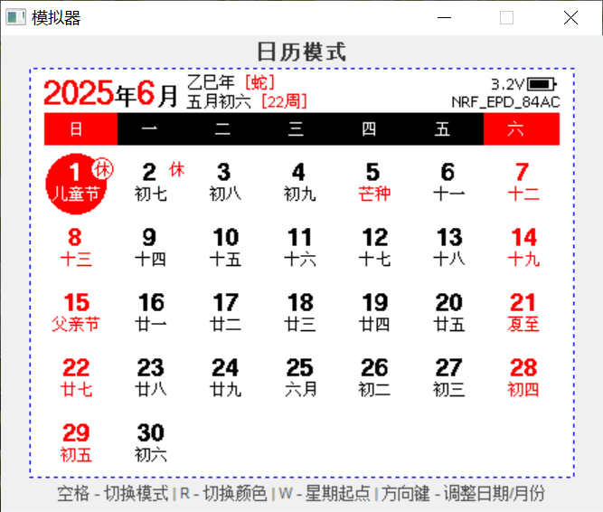

## Development

> **Note:**
> - Recommended to use [Keil 5.36](https://img.anfulai.cn/bbs/96992/MDK536.EXE) or lower versions (if pack downloads fail, you can download from the group files)
> - The `sdk10` branch contains the legacy SDK code with a smaller Bluetooth protocol stack footprint, used to support 128K Flash chips (no longer updated)

Using the nRF51 version project as an example (`Keil/EPD-nRF51.uvprojx`), the project configuration has several `Targets`:

- `nRF51822_xxAA`: Used to compile 256K Flash firmware
- `flash_softdevice`: Used to flash the Bluetooth protocol stack (only needs to be flashed once)

For programmers, you can use J-Link or DAPLink (you can use [RTTView](https://github.com/XIVN1987/RTTView) to view RTT logs).

**Flashing:**

1. Erase all (if you can't flash after erasing in Keil, try using the programmer's host software to erase)
2. Switch to `flash_softdevice`, download the Bluetooth protocol stack, **download directly without compiling** (only needs to be flashed once)
3. Switch to `nRF51822_xxAA`, compile first then download

### Crystal Oscillator Configuration

By default, this project does not use an external low-speed crystal oscillator (frequency: `32.768kHz`), because not all boards have this oscillator. Boards without a low-speed oscillator cannot run firmware that enables the low-speed oscillator.
If your board has an external low-speed crystal oscillator, it's recommended to modify it to use the external oscillator, as this will make the clock timing more accurate. Here's how to modify it:

**nRF51**

Modify `main.c`:

```c
#define NRF_CLOCK_LFCLKSRC      {.source        = NRF_CLOCK_LF_SRC_XTAL,             \
                                 .rc_ctiv       = 0,                                 \
                                 .rc_temp_ctiv  = 0,                                 \
                                 .xtal_accuracy = NRF_CLOCK_LF_XTAL_ACCURACY_20_PPM}
```
**nRF52**

Modify `sdk_config.h`:

```c
#define NRF_SDH_CLOCK_LF_SRC 1
#define NRF_SDH_CLOCK_LF_RC_CTIV 0
#define NRF_SDH_CLOCK_LF_RC_TEMP_CTIV 0
#define NRF_SDH_CLOCK_LF_ACCURACY 7
```

### Emulator

This project provides an emulator that can run GUI code on Windows, allowing you to view the effects after modifying the GUI code without downloading to the microcontroller.

Emulation screenshot:




**Compiling:**

After downloading and installing [MSYS2](https://www.msys2.org), open the `MSYS2 MINGW64` command window and execute the following commands to install dependencies:

```bash
pacman -Syu
pacman -S make mingw-w64-x86_64-gcc
```

Then `cd` to the project directory and execute `make` to compile the emulator executable.

**Modifying the GUI:**

After modifying the code in the GUI directory, simply re-execute the make command above to compile.

> **Note:** Code in the GUI directory must not depend on platform-specific things, such as microcontroller-specific API interfaces, otherwise compilation on Windows will fail. The correct approach is: calculate the data and put it in `gui_data_t` before calling the `DrawGUI` function, then pass it in through the `data` parameter.
