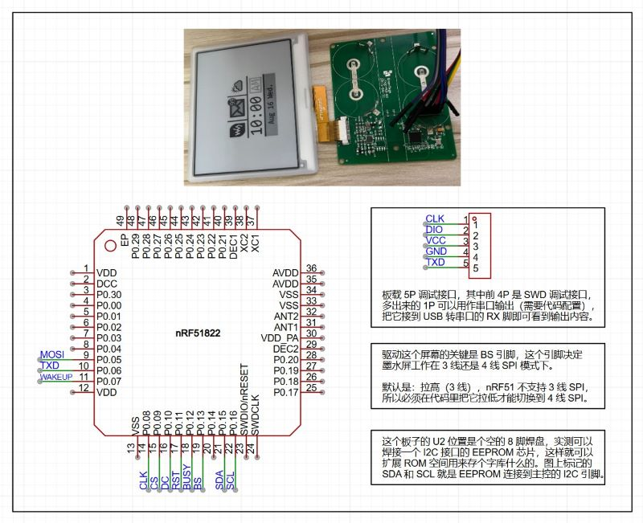

## Supported Devices

Theoretically, all electronic shelf labels (ESL) based on `nrf51822` / `nrf51802` / `nrf52811` / `nrf52810` are supported.

Below are several adapted ESL driver boards.

### Laowu 4.2-inch ESL, Black & White Version

- MCU: nrf51822
- RAM: 16K
- ROM: 128K
- Driver: UC8176
- Pin Config: `0508090A0B0C0D`
- Wakeup Pin: `07`

### Laowu 4.2-inch ESL, Black White Red 3-Color Version

- MCU: nrf51802
- RAM: 16K
- ROM: 256K
- Driver: UC8176
- Pin Config: `0A0B0C0D0E0F10`
- Wakeup Pin: `09`
- LED Pins: `03/04/05` (Three LEDs available, choose one to use)

### Sifei 52810

- MCU: nrf52810
- RAM: 24K
- ROM: 192K

### Hema/Alibaba 52811

- MCU: nrf52811
- RAM: 24K
- ROM: 192K

